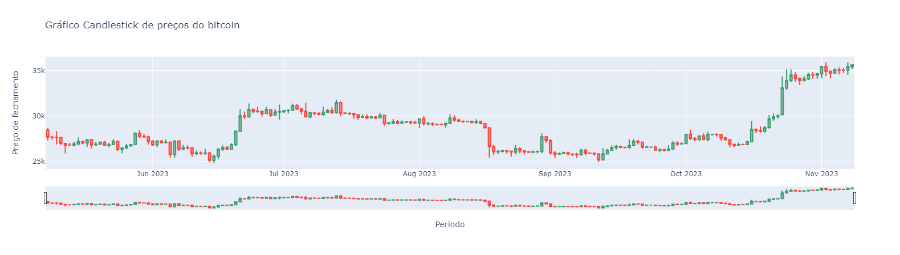

# Exportando um relatório em pdf do preço de criptomoedas utilizando python

## Objetivo do projeto

Projeto de análise e produção de um dashboard em pdf dos preços de Bitcoin, utilizando bibliotecas de data science em python.

## Bibliotecas utilizadas no desenvolvimento do projeto

Segue uma lista com as bibliotecas utilizadas no desenvolvimento e resolução deste case.

- pandas
- numpy
- pandas_datareader
- matplotlib
- plotly
- yfinance

## Deployment

Para executar o projeto é necessário baixar o arquivo "relatorio_criptomoedas_com_python.ipynb" (código do projeto). Feito isso,execute o código utilizando programas de visualização e leituras de códigos em jupyter notebook, como Visual Studio Code por exemplo, ou algum outro software similar.

Obs: para executar o código corretamente as bibliotecas listadas na sessão anterior precisam estar instaladas em sua máquina.

## Resultados

### Gráficos utilizando Matplotlib

Seguem abaixo os gráficos gerados a partir dos dados de preços do Bitcoin ao longo de um período de 6 meses, utilizando a biblioteca de visualização de dados Matplotlib.

- Gráfico de análise da oscilação dos preços de fechamento.

- Gráfico de análise da oscilação os preços de fechamento com a curva de tendência das médias móveis de 5 dias e 25 dias.

### Gráficos utlizando Plotly

Seguem abaixo os gráficos gerados utilizando a biblioteca de visualização de dados Plotly.

- Gráfico de análise da oscilação os preços de fechamento com a curva de tendência das médias móveis de 5 dias.

- Gráfico Candlestick utilizando os dados de abertura, fechamento além dos preços mais altos e baixos por dia do Bitcoin durante todos os dias do período analisado.

## Relatório final

Neste relatório final, foi criado um dashboard utilizando os gráficos em plotly, tanto candlestick mostrando a oscilação da cotação do bitcoin ao longo dos 6 meses, quanto o gráfico de fechamento com as médias móveis.

Para tal, utilizou-se da função make_subplots( ) da biblioteca Plotly, onde por meio desta é possível fazer mais de um gráfico no mesmo objeto, definindo-se o número de linhas e colunas necessárias, os títulos e etc.

Segue abaixo uma visualização do dashboard produzido.

Ao final do projeto, este dashboard presente acima foi exportado em um arquivo pdf "Report_Financeiro.pdf" presente nos arquivos deste repositório.